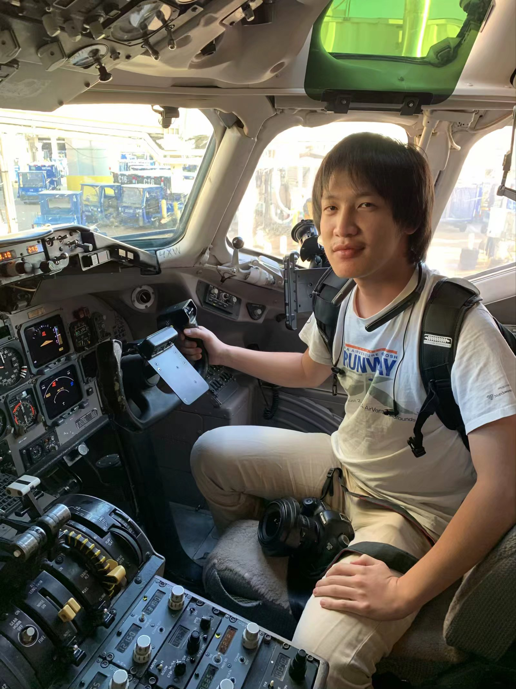

# About me

I am an incoming PhD student at the Department of Microbiology, Tumor and Cell Biology, Karolinska Instituet, Sweden.

Currently, I am a second year ScM student at the Department of Biochemistry and Molecular Biology, Johns Hopkins Bloomberg School of Public Health where my advisors are [Dr. Cynthia L. Sears](https://www.hopkinsmedicine.org/profiles/details/cynthia-sears) and [Dr. Stephanie Hicks](https://www.stephaniehicks.com/). My interest is in how tumorigenic bacteria induce colorectal cancer (CRC). I am curious about their tumorigenic mechanisms, host immune defenses against them and their interactions with other species in our microbiota. My current research focuses on the genetic basis of host-microbe interactions and aims to decode the bacterial communications by experimentally extracting and analyzing single-cell and bulk RNAseq data from CRC cancer patients and mouse models.  

Previously, I received my bachelor of arts in International Affairs and bachelor of science in molecular cellular biology from the George Washington University where I worked in [Dr. Xiaoyan Zheng's lab](https://smhs.gwu.edu/zheng-lab/lab-director) and studied novel tumor suppresors in NSCLC. [Paper](https://www.ncbi.nlm.nih.gov/pmc/articles/PMC6975268/)

## Also...
I am an avid transportation enthusiast since *age = 0*! I hold a pilot license, a boat license, and driving license of motorcycle and of course, four-wheel cars. My near-term goal is to get a city bus operating endorsement (in China, it's the A3 permit). I have been a part of the ATC team at [VATSIM PRC Division](https://www.vatprc.net/en/home) for 10 years.

{width=50% height=50%}
